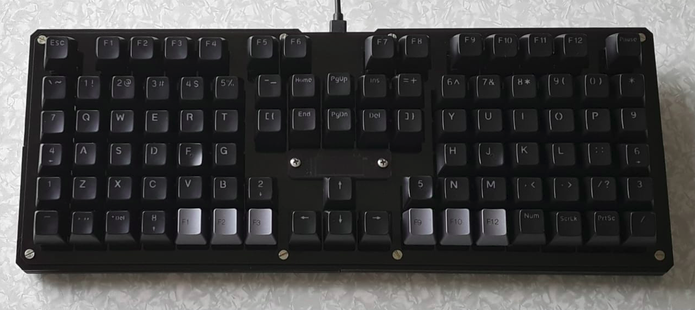
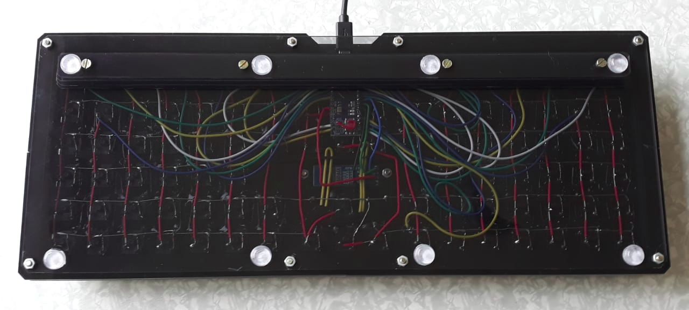
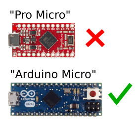
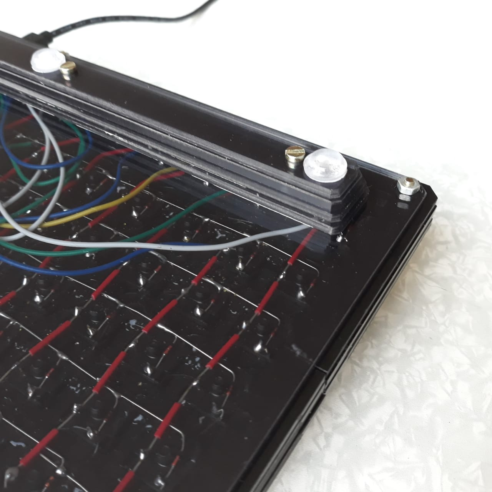
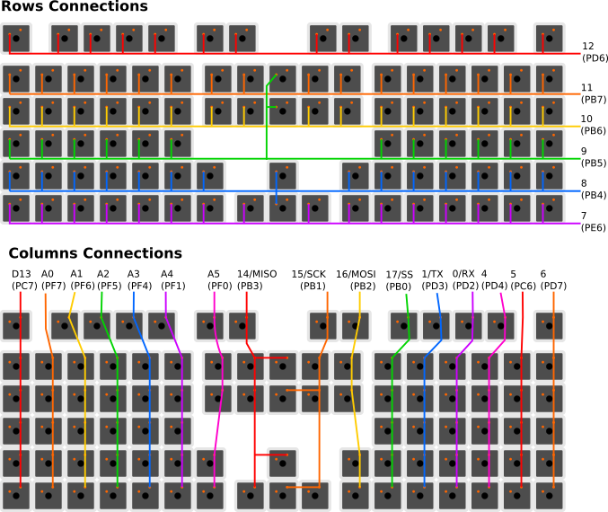
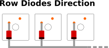
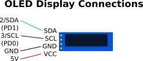

# Tarkus Keyboard

A handwired keyboard inspired on [Helix Keyboard](https://github.com/MakotoKurauchi/helix)
and on Xah Lee's [No Chord Keyboard](http://xahlee.info/comp/ultimate_keyboard_layout.html).
It uses the Arduino Micro (not Pro Micro), all 24 I/O pins are used. The
firmware is programmed with the (QMK Framework)[https://docs.qmk.fm/].

## Layout

The keyboard has the following modes: the Standard mode and the Programmer mode.

In the Standard mode, the keyboard works just as expected. Currently, it is
programmed with the Dvorak layout.

In the Programmer mode the keys on the numeric row are replaced with symbols,
reducing the need of using the Shift modifier.

In addition, there is the Numpad layer, that can be momentarily activated.

## Build Guide

Bill of materials:

* 1x Acrylic case;
* 1x [Arduino Micro](https://store.arduino.cc/usa/arduino-micro) or compatible;
* 92x Cherry MX switches, or compatibe;
* 92x diodes;
* 1x 0.91" Oled display module (128x32 px);
* 8x M3 screws (the legnth depends on the tickness of the case);
* 4x M3 screws (the length depends on the height of the foot);
* 2x M3 8mm screws (for the oled window);
* 14x M3 nuts;
* Silicone or rubber feet;
* wires, soldering tin, soldering iron.

> This project requires the **Arduino Micro** or compatible for the
> controller board. This is different from the "Pro Micro", which is widely
> used by the keyboard making community, and very available in the market.
> The "Arduino Micro" makes all 24 I/O ports of the ATMega32u4 available,
> while the "Pro Micro" makes just 18 of them available. Since this keyboards
> uses **all the 24 I/O ports**, the "Arduino Micro" (or compatible) should
> be used.

The default **acrylic case** is composed of the following parts:

* oled window - 1x 3mm (transparent);
* switch plate - 1x 3mm;
* spacer - 4x 3mm (or 2x 6mm);
* bottom plate - 1x 3mm;
* foot - 1x 3mm.

If you make the spacers with total height of 12mm, you have plenty of space to
do the wiring inside. And since the keyboard is quite wide, it won't look very
thick.

The **foot** is optional, and it can be attached to the bottom plate. Since it is
made of layers, it is possible to raise or lower the feet by adding or removing
them. Be warry of the m3 screws for the feet, you should also account the
thickness of the bottom plate.

## Wiring Diagram

The odd connections at the middle of the keyboard also should have similar diode
connections, the dioeds should be between the switch pin and the row, with the
marked end (cathode) pointing to the row line.

In the media directory there is a PDF file with these diagrams, so you can use
it if you find it handy.

## Flashing the Firmware

Currently the firmware is not available in the QMK repository.

To flash the firmware, copy the contents of the `src` directory of this repo
to `~/qmk_firmwarke/keyboards/handwired/tarkus`. Then compile running:

    qmk compile -kb handwired/tarkus -km default

And flash it running:

    qmk compile -kb handwired/tarkus -km default
